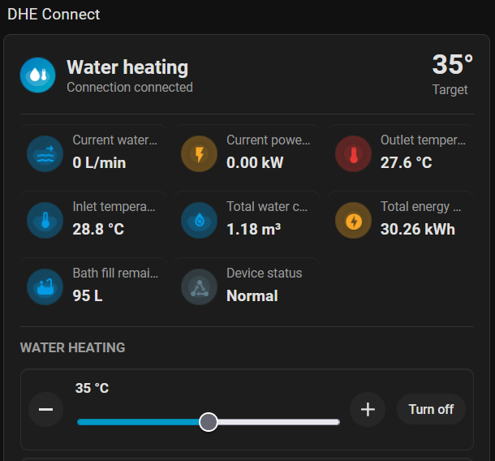
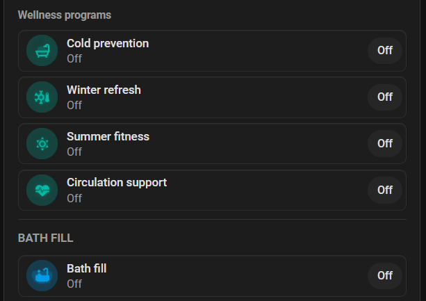
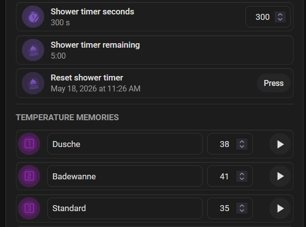
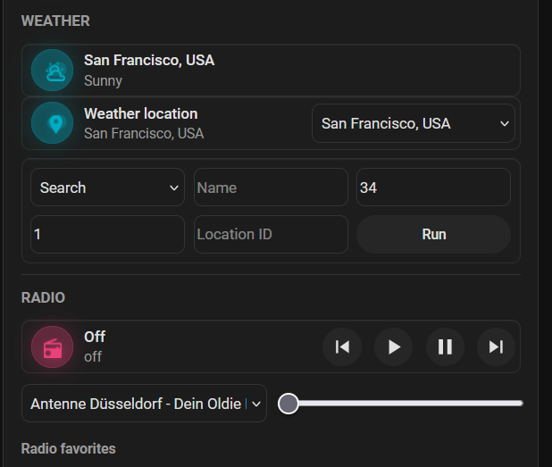

# DHE Connect Card

[](https://github.com/memphi2/ha-dhe-connect-card/actions/workflows/ci.yml)
[](https://github.com/memphi2/ha-dhe-connect-card/releases)
[](https://hacs.xyz/docs/faq/custom_repositories)
[](https://www.home-assistant.io/dashboards/)
[](LICENSE)

Mushroom-style Lovelace card for the `stiebel_dhe_connect` Home Assistant
integration. It discovers the entities of one DHE device and presents them as a
compact dashboard surface for water heating, Eco mode, wellness programs, bath
fill, timers, temperature memories, weather, radio and diagnostics.

Required integration baseline: `ha-dhe-connect >= 1.8.4`. Older integration
builds can miss the post-legacy entity naming and are not supported by current
card releases.

The public release line starts at `v0.5.0`. `v0.7.2` is the current
stabilization release.

The normal setup path is the Home Assistant visual card editor. YAML remains
available for advanced users, but section order, overview tiles, actions,
hidden entity keys, entity overrides, icon animations and display-style buttons
can be configured through the GUI.

## Screenshots

| Overview and water heating | Wellness and bath fill |
| --- | --- |
|  |  |
| Timers and memories | Weather and radio |
|  |  |

## What You Get

- Automatic device discovery through Home Assistant entity registry metadata.
- Enabled and visible entities are shown by default; disabled or hidden
  registry entities stay out of the card.
- German and English labels follow the Home Assistant frontend language.
- Crowdin/Weblate-ready JSON translations are validated in CI and can be
  extended by late runtime language packs.
- Optional diagnostics and support mode exports anonymized support packages and
  shows entity audit, compatibility and self-test panels for GitHub issues.
- Repeated device prefixes are removed from card titles, entity labels and
  state text.
- Tap, double-tap and hold actions use the Home Assistant/Mushroom action
  shape.
- State-aware icon colors and animations for flow, heating, bath fill, timers,
  radio, alarms and normal device states.
- Compact mode by default, with a responsive wide layout when the dashboard
  column has enough space.
- Optional display-style button tiles for Eco, wellness, bath fill, timers and
  temperature memories.
- Inline service-call errors plus Home Assistant notification events when a
  control action fails.
- CI coverage for type checking, linting, tests, HACS compatibility, HA storage
  fixtures, license checks and a Chromium render smoke test.

## Installation

The recommended installation method is HACS as a custom dashboard repository.

1. Open HACS.
2. Open custom repositories.
3. Add `https://github.com/memphi2/ha-dhe-connect-card`.
4. Select the dashboard or Lovelace category.
5. Install `DHE Connect Card`.
6. Reload the dashboard page.

HACS should create the dashboard resource automatically. If it does not, add it
manually:

```yaml
url: /hacsfiles/ha-dhe-connect-card/ha-dhe-connect-card.js
type: module
```

Manual builds are mainly for development and local testing:

```bash
npm ci
npm run build
```

Copy `dist/ha-dhe-connect-card.js` and
`dist/ha-dhe-connect-card.js.map` into:

```text
config/www/community/ha-dhe-connect-card/
```

Then add this resource:

```yaml
url: /local/community/ha-dhe-connect-card/ha-dhe-connect-card.js
type: module
```

Full install, update and cache-busting notes are in
[docs/installation.md](docs/installation.md).
Configuration baseline and upgrade checklist are in
[MIGRATION.md](MIGRATION.md).

## Quick Start (Visual Editor)

For most users this is enough:

1. Install through HACS (custom repository).
2. Add `DHE Connect Card` in the dashboard editor.
3. Select the DHE device in the mandatory device picker.
4. Save.

Then optionally tune:

- `Overview tiles` to choose and order the top metrics
- `Sections` to show and reorder feature blocks
- `Actions` for tap, hold and double-tap behavior
- `Visuals` for icon theme, animations and display-style buttons

## Add The Card

Use the Home Assistant dashboard UI for normal setup:

1. Edit the dashboard.
2. Add a new card.
3. Choose `DHE Connect Card`.
4. Select the DHE Home Assistant device.
5. Configure sections, overview tiles, actions and visual options in the editor.

The visual editor requires the DHE Home Assistant device as the primary
selection. When Home Assistant exposes registry metadata to the frontend, the
card finds the entities from that device automatically.

After a Home Assistant 2026.8 device split, the card resolves a stale saved ID
only when one registered DHE device is unambiguous. With more than one DHE device,
select the device again in the visual editor and save the card.

Minimal YAML config:

```yaml
type: custom:dhe-connect-card
device_id: <home_assistant_device_id>
```

## Visual Configuration

The visual editor covers the options most users need:

- mandatory primary device selection through the Home Assistant device selector
- collapsed device preview with a friendly selected-device status
- mandatory `device_id` anchor (no legacy top-level `entity` migration path)
- diagnostics, dangerous actions and optional entities
- masonry-like layout modes and dynamic tile sizing for dashboard widths
- icon animations and display-style button tiles
- visible sections and section order with drag handles
- overview tile selection, order and column count from active, discovered entity keys
- advanced overview tiles with conditional tile colors,
  delta values, trend indicators and inline sparklines when HA attributes
  provide history or change data
- Home Assistant style form fields, inline help and tooltip hints for editor
  options
- tap, hold and double-tap action controls
- service-action targets and JSON service data
- entity visibility toggles
- domain-filtered entity override pickers for all known card functions

Editor changes are stored as normal Lovelace card config, so GUI and YAML edits
stay compatible.

Setting an action to `none` disables that interaction entirely. A disabled hold
or double-tap action will not delay or suppress normal clicks.

## YAML Example

The same configuration can be written manually when a dashboard is maintained
as YAML or when advanced copy/paste editing is easier:

```yaml
type: custom:dhe-connect-card
device_id: <home_assistant_device_id>
show_unavailable: false
show_optional: false
show_diagnostics: true
show_dangerous_actions: false
show_weather_services: false
show_icon_animations: true
show_display_buttons: false
show_support_mode: false
layout_mode: auto
tile_size: auto
overview_columns: 3
overview_entities:
  - water_flow
  - power
  - outlet_temperature
  - inlet_temperature
  - water_consumption_total
  - energy_consumption_total
  - bath_fill_remaining_volume
sections:
  - overview
  - controls
  - bath
  - timers
  - memory
  - consumption
  - saving
  - weather
  - radio
  - diagnostics
  - actions
entities:
  water_flow: sensor.dhe_connect_current_water_flow
  eco_mode: switch.dhe_connect_eco_mode
tap_action:
  action: more-info
hold_action:
  action: navigate
  navigation_path: /lovelace/dhe
double_tap_action:
  action: toggle
```

Common options:

| Option | Default | Purpose |
| --- | --- | --- |
| `device_id` | unset | Required in the visual editor; selects the HA device used to scope entity discovery. |
| `layout_mode` | `auto` | Dashboard section flow: `auto`, `mini`, `tablet`, `panel` or `kiosk`. |
| `tile_size` | `auto` | Dynamic overview and display tile sizing: `auto`, `compact`, `normal` or `large`. |
| `overview_columns` | `3` | Number of overview tile columns outside very narrow mobile cards. |
| `overview_entities` | `[water_flow, power, outlet_temperature, inlet_temperature, water_consumption_total, energy_consumption_total, bath_fill_remaining_volume]` | Known entity keys shown as overview tiles, in display order. |
| `section_entity_order` | `{}` | Optional per-section entity key order from drag handles in the **Entities** editor. |
| `sections` | all sections | Ordered visible sections. |
| `hide_entities` | `[]` | Known entity keys to hide. |
| `entities` | `{}` | Per-key entity overrides. |
| `show_icon_animations` | `true` | Enables animated colored icon states. |
| `icon_theme` | `state` | Icon color behavior: `state`, `ha`, `muted`, `vivid` or `custom`. |
| `icon_colors` | `{}` | Optional per-tone CSS colors for `icon_theme: custom`, for example `water`, `hot`, `energy`, `eco`, `status` or `alert`. |
| `show_display_buttons` | `false` | Shows device-display-like button tiles. |
| `show_support_mode` | `false` | Shows the support section with anonymized export, entity audit, compatibility checks and self-test. |
| `tap_action` | `more-info` | Action for a normal click. |
| `hold_action` | unset | Action for long press. |
| `double_tap_action` | unset | Action for double click. |

`hold_action` and `double_tap_action` can be set to `none` when you want them
explicitly disabled. The card treats those as inactive interactions, matching
the expected Mushroom-style behavior.

The complete schema, all entity keys and additional examples are in
[docs/configuration.md](docs/configuration.md).
Translation workflow details are in [docs/translations.md](docs/translations.md).

`icon_theme: state` follows Home Assistant theme variables by default. Select
`custom` in the visual editor to override individual icon tones with hex colors
or HA CSS variables such as `var(--primary-color)` and `var(--error-color)`.

## Behavior

The header prefers live device information in this order: connection state,
device status, error status and discovery fallback. This keeps the normal
device state visible before error-only details.

Icon color and motion are tied to entity meaning and state. Water flow moves
only when a flow is present, bath fill uses a fill motion, timers rotate, active
radio shows a broadcast pulse, error and alarm states use the alert tone and
active water heating shifts from the blue water tone toward a warmer heat tone.

The card adapts to the width Home Assistant gives it. Narrow dashboard cards
stack all sections vertically while still using the configured overview column
count outside very narrow mobile cards. Wider dashboard columns keep the
overview across the top and arrange controls, weather, radio, diagnostics and
other sections as side-by-side blocks instead of stretching every row.

Radio favorites are rendered from the integration's media-player source and
favorite attributes. Selecting a favorite calls `media_player.select_source`.
Adding or removing stations still belongs to the backend integration flow until
dedicated Home Assistant services exist for it.

Weather service helper controls are disabled by default. When enabled, only the
known `stiebel_dhe_connect` weather helper services and their documented fields
are sent to Home Assistant.

Dangerous buttons, such as pairing actions and memory deletion, require
confirmation and are hidden unless explicitly enabled.

## Accessibility

- Card controls use semantic interactive elements (`button`, `input`, `select`)
  with explicit ARIA labels.
- Focus indicators are always visible on keyboard focus, including overview
  tiles, section controls and support-mode rows.
- Visual-editor tooltip help icons are semantic keyboard-focusable buttons and
  do not interfere with foldout toggling.
- Visual-editor drag handles support keyboard reordering with
  `ArrowUp`/`ArrowDown`.
- Support mode is exposed as an accessible region with labeled panels, list
  semantics and polite status updates for self-test changes.
- Reduced-motion environments disable icon motion and transition-heavy effects
  automatically.

## Compatibility

This is a modern Lovelace custom card built as an ES module. It requires Home
Assistant 2026.4 or newer and is intended for current dashboards and HACS
custom dashboard repositories. CI runs on Node.js 24 and validates the
generated bundle, HACS metadata and packaged release archive.

## Local Validation

```bash
npm run check
npm run docs-check
npm run render-smoke
```

Optional Home Assistant smoke checks require private test-instance credentials
and must be run with environment variables, not committed files:

```bash
HA_TEST_URL=http://<ha-test-host>:8123 \
HA_TEST_TOKEN='<long-lived-access-token>' \
npm run smoke
```

Username/password login is still supported for temporary test accounts, but the
long-lived token path avoids creating temporary Home Assistant refresh tokens:

```bash
HA_TEST_URL=http://<ha-test-host>:8123 \
HA_TEST_USERNAME='<user>' \
HA_TEST_PASSWORD='<password>' \
npm run smoke
```

More validation details are in [docs/development.md](docs/development.md).

## Documentation

- [Installation](docs/installation.md)
- [Migration guide](MIGRATION.md)
- [Configuration](docs/configuration.md)
- [Troubleshooting](docs/troubleshooting.md)
- [Development, CI and smoke tests](docs/development.md)
- [Legal and intellectual property notes](docs/legal.md)
- [Release process](RELEASING.md)
- [Latest release notes](release-notes/v0.7.2.md)
- [Changelog](CHANGELOG.md)
- [Third-party notices](THIRD_PARTY_NOTICES.md)

## Legal Notes

This project is an unofficial community custom card. It is not affiliated with,
endorsed by or sponsored by STIEBEL ELTRON, Home Assistant, HACS, Mushroom,
OpenAI or their respective owners.

Product and project names are used only to describe compatibility and the
target ecosystem. The bundled screenshots are project-local images of this
card's own rendered UI and intentionally do not include vendor logos, copied
product marks, official app screenshots or product photos.

This repository must not contain vendor JavaScript, CSS, HTML, firmware,
screenshots, product artwork, logos or copied web-interface templates. The
automated validation scans tracked files for common secrets, private network
addresses, undocumented media, proprietary DHE web assets and known proprietary
license or copyright markers.

Unless a file states otherwise, the code, documentation and bundled
project-local assets in this repository are licensed under the MIT License. The
license does not grant rights to third-party trademarks, DHE device firmware,
vendor web interfaces, Home Assistant, Mushroom or other third-party assets.

The card was built iteratively with OpenAI Codex as the implementation agent
for this repository. That note describes the development workflow only; it does
not imply endorsement by OpenAI, Home Assistant, Mushroom or STIEBEL ELTRON.

See [docs/legal.md](docs/legal.md) for the current IP audit notes.
